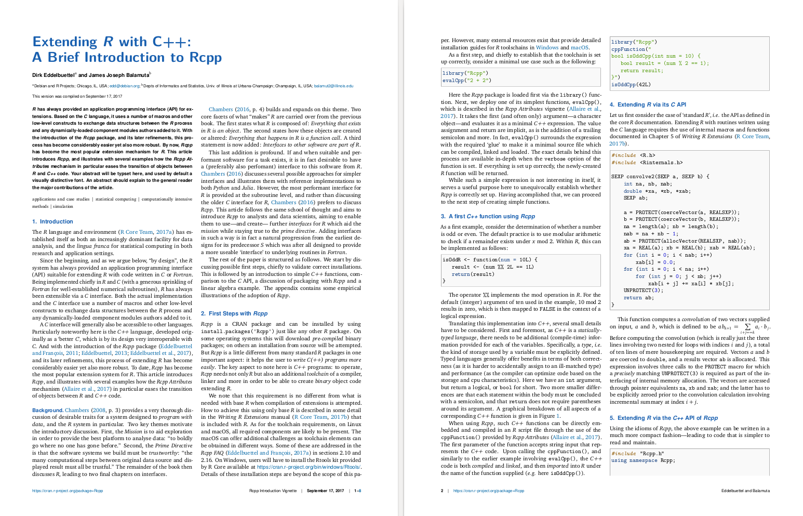
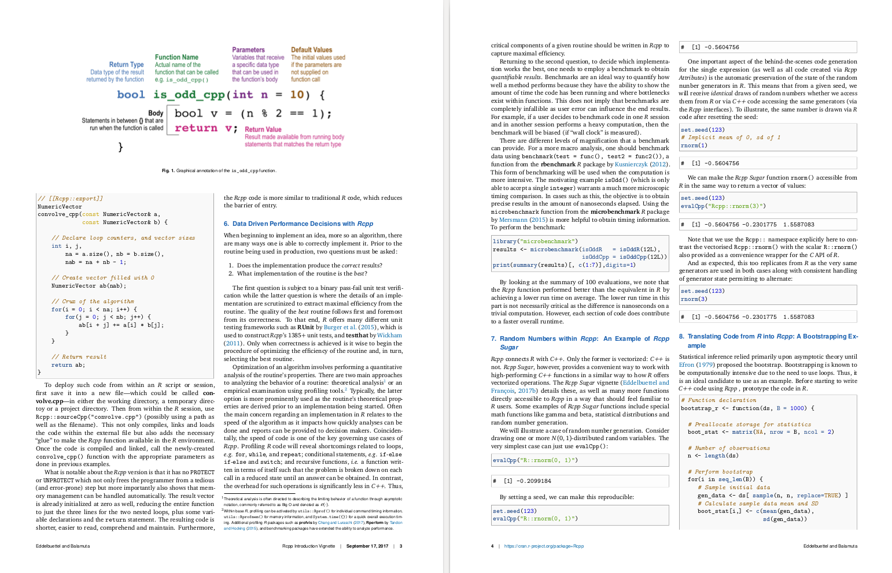

## pinp [](https://travis-ci.org/eddelbuettel/pinp) [](http://www.gnu.org/licenses/gpl-3.0.html) [](https://cran.r-project.org/package=pinp) [](http://www.r-pkg.org/pkg/pinp)

Pinp is not PNAS

### Motivation

The template provided by the PNAS Article template in the
[rticles](https://cran.r-project.org/package=rticles) package makes it very easy and convenient to
create attractive looking two-column papers.

There were however a few changes we wanted to make such as the use of standard natbib citations and
the removal of a number of PNAS-specific title page items as well as general code and use
simplification via a single LaTeX class file.  So pinp started.

### Example

A complete pdf example is provided [here](https://eddelbuettel.github.io/pinp/Rcpp-introduction.pdf)
by the new introductory [Rcpp](http://dirk.eddelbuettel.com/code/rcpp.html) vignette, which is
itself based on our [PeerJ Prepint](https://peerj.com/preprints/3188/).

A screenshot of the first two pages:



and the next two pages, showing a two-column figure.



We are cheating slighly here as we started the vignette based on the LaTeX sources from the PeerJ Prepint.
The goal is, however, to produce vignettes and papers just likes this straight from Markdown.

### Status

The package is in alpha mode and working, but not yet on [CRAN](https://cran.r-project.org/).

### Usage 

Use your favourite tool to install from GitHub, _e.g._,

```shell
$ installGithub.r eddelbuettel/pinp          # using a script from littler
```

and then use as a Markdown template via RStudio, or call `rmarkdown::render()` directly.

### Requirements

Beyond the R package dependencies, a working `pandoc` binary is needed. RStudio installs
its own copy, otherwise do what is needed on your OS (_i.e._, something like `sudo apt-get
install pandoc pandoc-citeproc`).

The pdf mode requires a fairly complete LaTeX installation, and has been used on Ubuntu and macOS.  
On Debian/Ubuntu, the following packages should provide a working set:

```
texlive-base
texlive-binaries
texlive-fonts-extra
texlive-fonts-recommended
texlive-generic-recommended
texlive-humanities
texlive-latex-base
texlive-latex-extra
texlive-latex-recommended
texlive-pictures
texlive-publishers
texlive-science
```

### Authors

Dirk Eddelbuettel and James Balamuta, leaning heavily on JJ et al in the 
[rticles](https://cran.r-project.org/package=rticles) package.

The authors of the underlying [PNAS LaTeX Style](http://www.pnas.org/site/authors/latex.xhtml) are not 
explicitedly listed, but [PNAS](http://www.pnas.org) refers to [Overleaf](https://www.overleaf.com/).

### License

GPL-3 for this package and the code from [rticles](https://cran.r-project.org/package=rticles),
the [PNAS LaTeX](http://www.pnas.org/site/authors/latex.xhtml) material is under 
LaTeX Project Public License >= version 1.3
